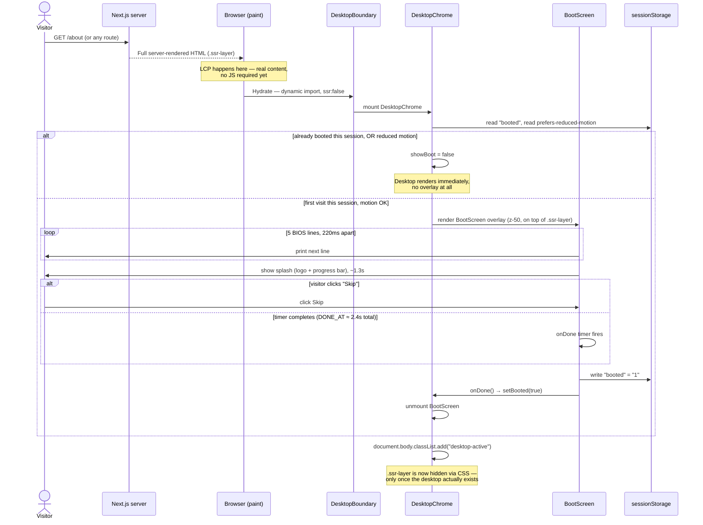

# Sequence diagram — boot sequence

What happens between first paint and an interactive desktop. The boot screen is an *overlay*
over already-rendered content, never a loader gating that content — see the "Boot sequence as
overlay, never a loader" entry in `DECISIONS.md`.

**Why LCP isn't affected by any of this:** the server-rendered content is already painted
before the desktop layer even starts hydrating (`DesktopBoundary` is `dynamic(..., { ssr:
false })`). The boot overlay, when it runs, sits on top of content that was already there —
it delays nothing perceptible to a search crawler or a no-JS visitor, and the perf budget
(`CLAUDE.md`: LCP ≤2.0s) is measured against that first server paint, not against the desktop
becoming interactive.

**Why `.ssr-layer` is hidden only after mount, not via a server-side flag:** hiding it earlier
would mean a hydration mismatch or a flash of hidden content for the no-JS/JS-disabled case
this architecture exists to serve. It only disappears once `DesktopChrome` has actually
mounted client-side and has somewhere else to put the same content.

---
_Last updated: 2026-09-14 · reflects v1.1.2_
