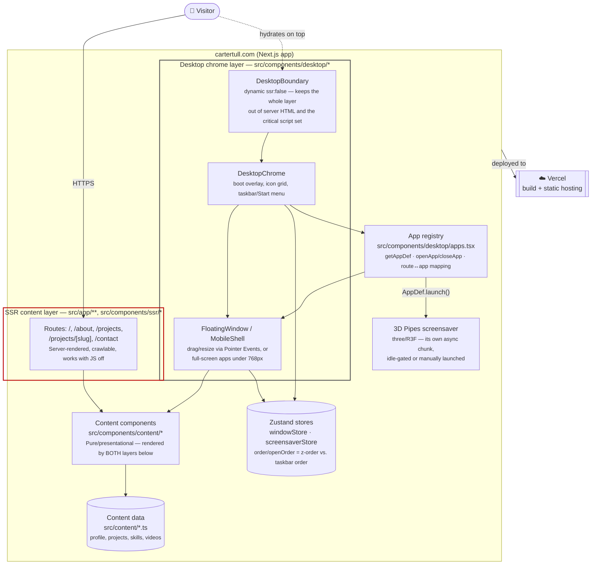

# C4 — Level 2: Containers

The high-level pieces inside the app (`src/`) and how they depend on each other. "Container"
here means a deployable/runnable unit in the C4 sense, not a Docker container — this whole
diagram is one Next.js app, but its internal seams are exactly the ones `CLAUDE.md` calls out.

**The seam that matters:** `content` (pure, presentational, knows nothing about windows) is
rendered by both `routes` (server-side) and `windows` (client-side, inside a floating window
or the mobile full-screen shell). Neither the SSR layer nor the desktop layer owns its own
copy of what a page says — see [`dual-layer-architecture.md`](dual-layer-architecture.md) for
the full picture of that rule, which is this project's central architectural decision.

**Why the store is drawn separate from `DesktopChrome`:** `windowStore` is readable outside
React via `getState()`, so `apps.tsx` (`openApp`/`closeApp`) can imperatively open/close
windows from icon clicks or route changes without those call sites being React components
themselves — see the "Zustand for the window manager" entry in `DECISIONS.md`.

---
_Last updated: 2026-09-14 · reflects v1.1.2_
