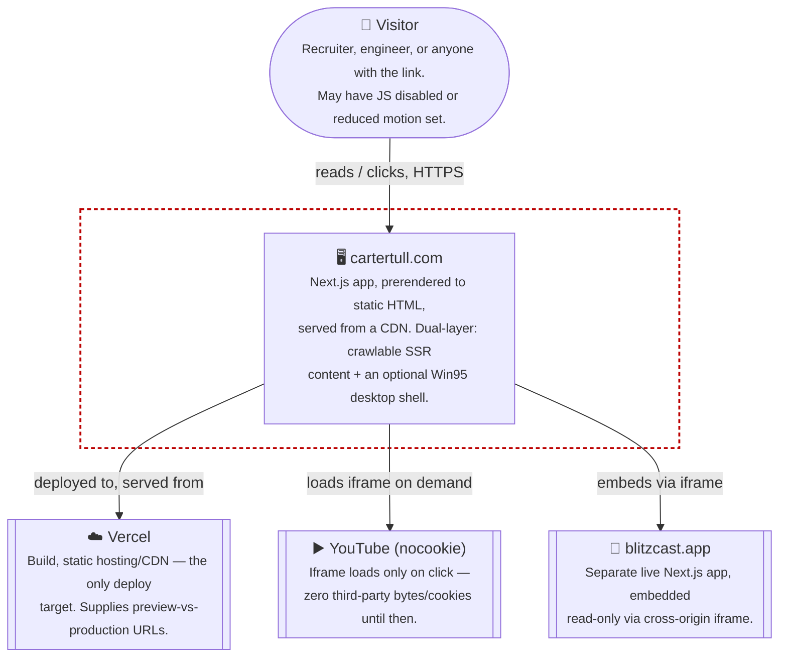

# C4 — Level 1: System Context

Where the site sits relative to the people and systems around it. No backend, no database,
no third-party auth — the entire "system" is a statically-prerendered Next.js app.

> Drawn as a flowchart, not Mermaid's native `C4Context` type — that renderer is still
> experimental and inconsistent on GitHub. This follows standard C4 Level-1 conventions
> (person, system boundary, external systems) without relying on it.

**Why no database, auth, or API layer is on this diagram:** there isn't one. Every route is
prerendered at build time from `src/content/*.ts`; the only runtime state is client-side
(window positions, the CRT toggle, boot-once — all `sessionStorage`/`localStorage` or
in-memory). See [`deployment-security.md`](deployment-security.md) for how that shrinks the
attack surface, and `SECURITY.md` for the policy this maps to.

**Why Blitzcast and YouTube are external systems, not features:** both are genuinely
separate products this site links into, not data this site owns — see the "Blitzcast is a
desktop-only app" and "YouTube via facade pattern" entries in `DECISIONS.md`.

---
_Last updated: 2026-09-14 · reflects v1.1.2_
