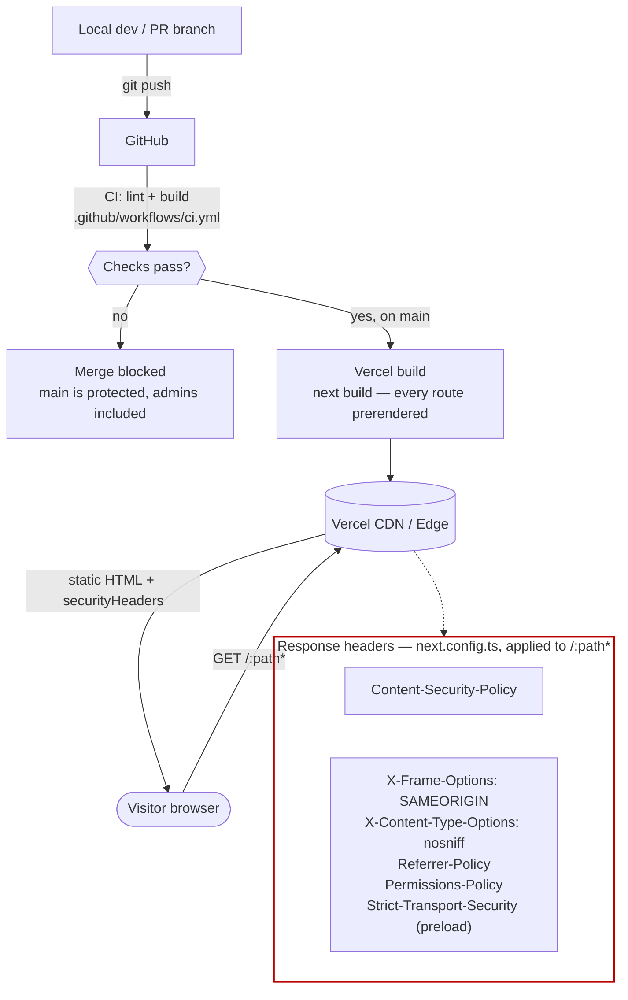

# Deployment & security

Request path through Vercel, and where the CSP's load-bearing exceptions come from. Full
policy lives in `SECURITY.md`; this shows the *mechanism* behind it.

## The CSP's three load-bearing exceptions

| Directive | Why it isn't the strict default |
| --- | --- |
| `frame-src 'self'` | Chrome renders the resume PDF `<object>` through an **internal viewer frame** — without this, the resume window fails silently (blank, no fallback), not loudly |
| `object-src 'self'` | Needed for that same `<object>` PDF embed |
| `frame-ancestors 'self'` (not `'none'`) | These headers ride on `/Carter-Tull-Resume.pdf` itself — `'none'` would forbid the resume window from framing its own PDF |

`script-src` also keeps `'unsafe-inline'` rather than a nonce: every one of the 31 routes
prerenders to static HTML, and a nonce must be unique per response, which would force
per-request rendering and trade away the site's entire static-delivery story (and the LCP
≤2.0s budget) for XSS defense on a site with no user input, auth, cookies, or database. See
"CSP keeps `'unsafe-inline'`..." in `DECISIONS.md` for the full trade-off, and revisit the
moment this site gains a form or a dynamic route.

**How these were actually verified — not just read on paper:** two of the exceptions above
were found by loading a production build in a real browser and watching the resume window
come up blank, not by reading the CSP spec. `CLAUDE.md` calls this out as a standing
requirement: verify any CSP edit against `npm run build && npx next start` in a real browser.

## Why the attack surface is this small

No backend, no database, no auth, no cookies, no user input anywhere in the app — every route
is prerendered at build time and served as static HTML from a CDN. `NEXT_PUBLIC_SITE_URL` is
the only environment variable, and it's a public value by design. Dependabot (grouped weekly
updates + security alerts; React 19.3+ and TypeScript 7+ ignored until upstream peers support them) and secret-scanning push protection are enabled at the repo level.
See `SECURITY.md` for the reporting policy and scope.

---
_Last updated: 2026-09-21 · reflects v1.1.3_
