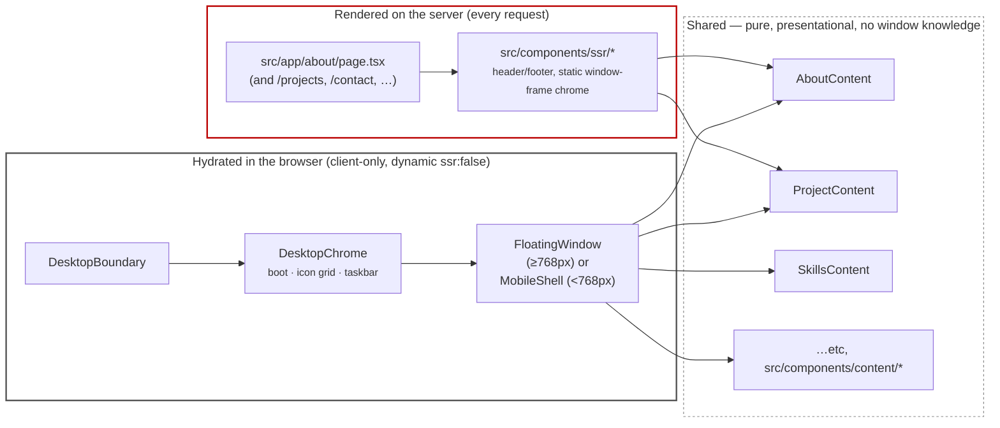

# Component diagram — dual-layer architecture

`CLAUDE.md` calls this "the one rule that matters": content and desktop chrome are separate
layers, and content must never exist only inside a window. This is the project's most
distinctive engineering decision, so it gets its own diagram rather than living only inside
the C4 container view.

**Why it's built this way:** a crawler, a link-preview bot, a no-JS browser, and a
`prefers-reduced-motion` visitor all get the *exact same content* the server rendered — not a
stripped-down fallback. The desktop shell is presentation layered on top, never the only
place the content exists. The rejected alternative — render content only inside windows after
a click, the common "Win95 portfolio" approach — is invisible to crawlers and blocks LCP on a
JS boot. See the "Dual-layer architecture" entry in `DECISIONS.md`.

**How a page gets read twice:** `src/app/about/page.tsx` renders `<AboutContent>` directly
into server HTML. Separately, `apps.tsx`'s `about` entry in the app registry renders that same
`<AboutContent>` inside a `FloatingWindow` once the desktop hydrates. Same component, same
props shape, two call sites — nothing in `AboutContent` itself knows or cares which one is
rendering it.

**Enforcement, not just convention:** `DesktopBoundary` dynamically imports `DesktopChrome`
with `ssr: false`, so the whole client layer (store, windows, taskbar) is structurally
incapable of shipping content the server didn't already render — there's no code path where
the desktop layer is the *first* place a visitor's content appears.

---
_Last updated: 2026-09-14 · reflects v1.1.2_
