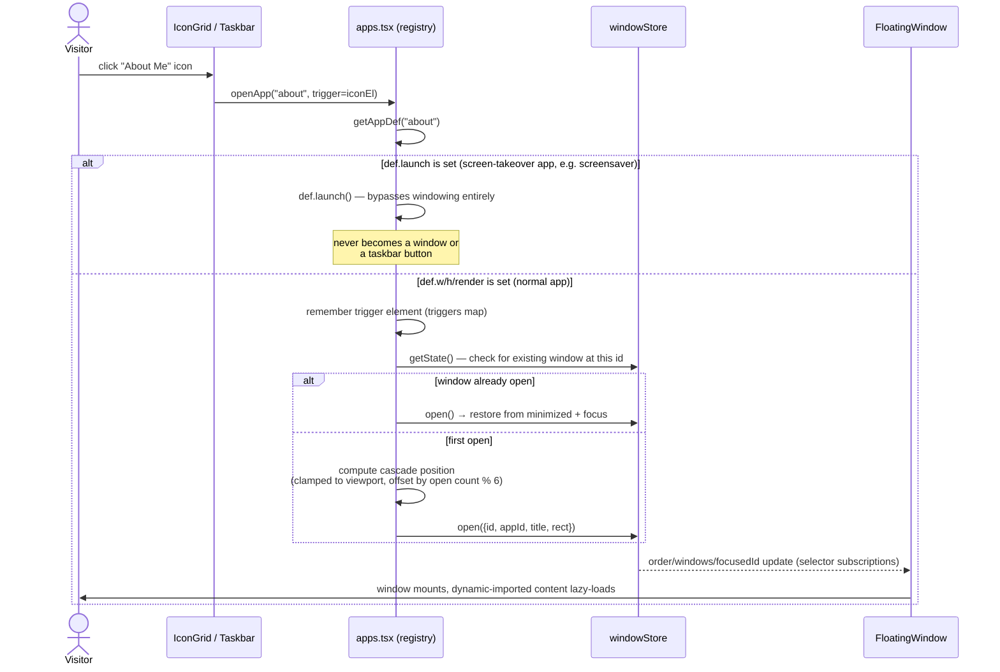
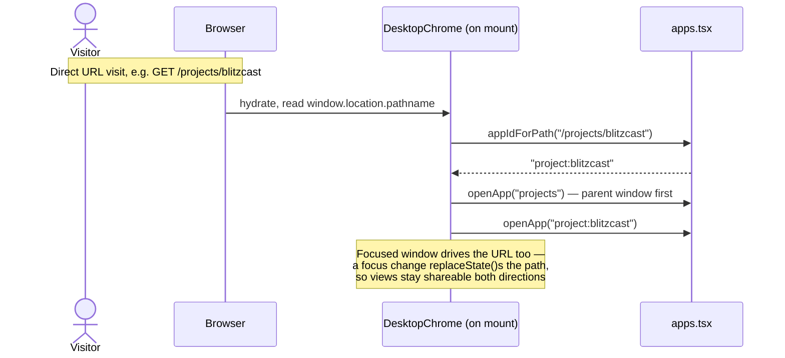

# Sequence diagram — opening an app

What happens when an icon is clicked, contrasted with a direct URL visit landing on the
desktop layer already hydrated. Both paths converge on the same `openApp()`.

**Mobile takes a different last step, not a different flow:** below 768px, `apps.tsx` and
`windowStore` behave identically — the branch is purely in what renders the window's content:
`FloatingWindow` (draggable/resizable, desktop) vs. `MobileShell` (full-screen, titlebar with
an X, bottom bar) via `useIsMobile()`. Neither forks the app registry or the store.

**Why singleton windows (id === appId):** re-opening an already-open app restores and focuses
it rather than spawning a duplicate — matches how a visitor actually uses a portfolio, and
keeps the taskbar/route mapping one-to-one. See "Window id === appId" in `DECISIONS.md`.

**Why content is dynamically imported per-app:** each `Content` component (`AboutContent`,
`ProjectContent`, …) is `dynamic()`-imported in `apps.tsx`, so a visitor who only ever opens
"About" never downloads the Skills or Contact bundles — part of the critical-JS-under-150KB
budget in `CLAUDE.md`.

---
_Last updated: 2026-09-14 · reflects v1.1.2_
