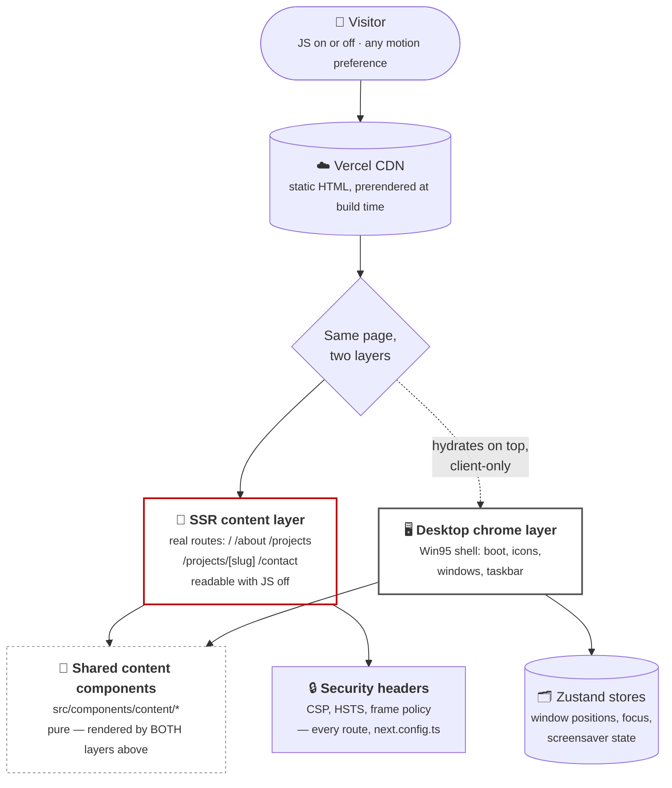

# Overview — the whole site in one diagram

Start here. Every idea below is expanded in its own diagram — follow the links at the bottom
for the detail behind any one piece.

**The one thing to take away:** this is a normal, boring, fully-crawlable content site that
happens to *also* present itself as a desktop, not a desktop app with a content site bolted
on for SEO. If you disable JavaScript right now, every page still works.

## Go deeper

| Question | Diagram |
| --- | --- |
| Who talks to this system, and what does it talk to? | [`c4-context.md`](c4-context.md) |
| What are the internal pieces and how do they depend on each other? | [`c4-container.md`](c4-container.md) |
| How exactly do the two layers share content? | [`dual-layer-architecture.md`](dual-layer-architecture.md) |
| What are the actual types behind the store and app registry? | [`class-diagram.md`](class-diagram.md) |
| What states does a window move through? | [`window-lifecycle-state.md`](window-lifecycle-state.md) |
| What happens between first paint and an interactive desktop? | [`boot-sequence.md`](boot-sequence.md) |
| What happens when an icon is clicked? | [`open-app-flow.md`](open-app-flow.md) |
| How is this deployed and secured? | [`deployment-security.md`](deployment-security.md) |

---
_Last updated: 2026-09-14 · reflects v1.1.2_
