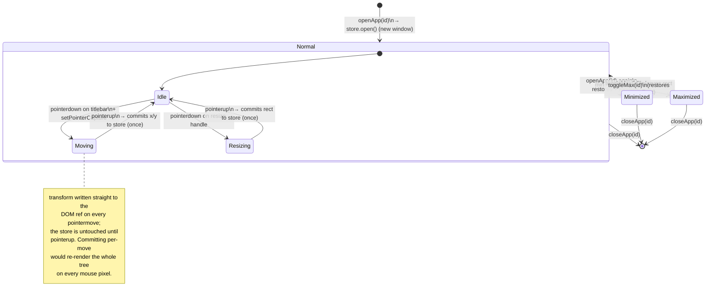

# State diagram — window lifecycle

The states a window (`Win` in `src/store/windowStore.ts`) moves through, and exactly what
triggers each transition. `state` is one of `"normal" | "minimized" | "maximized"` — a window
not in `windows: Record<id, Win>` at all is "closed," which isn't a stored state, just absence.

**Focus is orthogonal to this diagram, not a state of the window itself:** `focusedId` and
`order` (z-order, back-to-front) live at the store level and change on `focus()` — clicking
any visible window, opening one, or `toggleMax()`-ing one all call it. A minimized window can
never be focused (`topVisible()` skips it when picking the next `focusedId` on close/minimize).

**Two orderings, deliberately not one:** `order` reshuffles on every focus (it's z-index);
`openOrder` is append-only and only changes on open/close, so taskbar buttons stay in
first-opened order regardless of which window is currently on top — see the "Separate
z-order and taskbar-order arrays" entry in `DECISIONS.md`.

**Why `Moving`/`Resizing` aren't in the `state` field at all:** they're transient UI states
scoped to `FloatingWindow`'s pointer handlers, not window lifecycle the rest of the app needs
to know about — see `src/components/desktop/FloatingWindow.tsx` and the "Hand-rolled Pointer
Events drag/resize" entry in `DECISIONS.md`.

---
_Last updated: 2026-09-14 · reflects v1.1.2_
